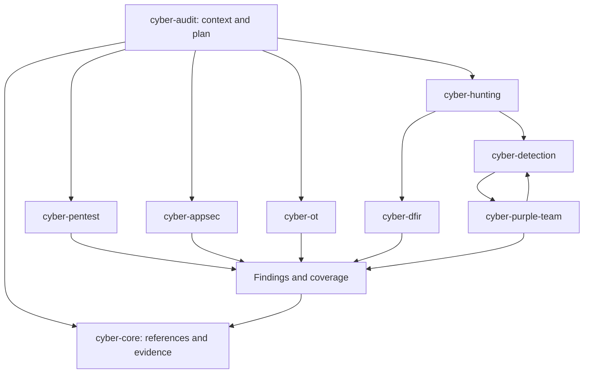

# Library architecture

Codex discovers nine skills. The audit coordinator selects from eight domains, which load their methods as needed. Each method belongs to one domain. A handoff passes the evidence and the question the next domain needs to resolve.



The arrows show information flow. They do not trigger agent delegation or tool execution.

## Responsibilities

| Domain | Responsible for | Handoff when needed |
|---|---|---|
| Core | Controls, taxonomies, evidence and priorities | Send the scenario and question to the technical domain |
| Pentest | Exposure and authorized active verification | Send code causes to AppSec and industrial equipment checks to OT |
| AppSec | Code, application configuration and fixes | Send remote verification to Pentest and detection signals to Detection |
| Detection | Rules, telemetry requirements and tests | Send alert delivery tests to Purple team |
| Hunting | Investigative hypotheses and pivots | Send incidents to DFIR and repeatable detections to Detection |
| Purple team | Test scenarios and evidence at each stage | Send failures to the responsible component owner |
| DFIR | Preservation, collection, timelines and analysis | Send fixes to AppSec and rule changes to Detection |
| OT | Physical process, equipment, protocols and operating constraints | Send embedded code questions to AppSec with the OT constraints |

## Files

```text
skills/
  cyber-audit/       audit coordination, shared contract, local tools and source registry
  cyber-core/        threat models, research, triage, controls and ATT&CK index
  cyber-pentest/     network exposure, Windows/AD and Linux
  cyber-appsec/      code, platforms, cloud and AI
  cyber-detection/   Sigma, YARA and SIEM
  cyber-hunting/     hypothesis-driven investigation
  cyber-purple-team/ detection chain validation
  cyber-dfir/        evidence, endpoints and incident response
  cyber-ot/          architecture, protocols, firmware and vendors
scripts/            compilation, validation, installation and source checks
tests/              tool tests, queries and Semgrep fixtures
```

Edit methods in `references/modules/*.md` or the domain reference files. Additional specialist controls live in `domain-controls.json`. `compile_controls.py` builds 58 records containing applicability, procedure, evidence requirements, references and execution conditions. They can be queried offline.

The MITRE snapshot is a derived index, identified by its source commit and input bundle hashes. Trail of Bits file contents are unchanged. Their entry files are named `SOURCE.md` so that Codex treats them as references rather than additional skills. The provenance lock records the path mapping.

## Handoff and results

Pass the objective, asset and version, identity, established permissions, hypothesis, available evidence and unresolved question. Return the finding, status, preconditions, effect, reference, proposed fix and a check that could disprove the finding.

Plan entries remain `not-tested` until execution. Scanner imports remain `candidate`. A status of `confirmed`, `fixed` or `retested` requires an explicit decision and evidence in the audit record. Coverage records distinguish tested, partial, untested, inapplicable and blocked checks.

## Updates

Review one source at a time. Compare versions, check licence and compatibility, then rerun the relevant tests. A standard update must not silently change control identifiers in an existing report. Select payload and detection references for a specific question; importing a collection does not add an autonomous scan capability.

`scripts/build_attack_index.py` builds a candidate index from explicitly supplied local STIX bundles, a commit and a licence. It writes to a new directory. Check the input hashes against the stated commit before adopting the result. It does not download data or replace the active snapshot.
